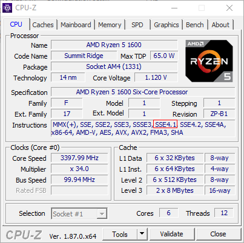

# VMware AMD Hackintosh

I see that you want to make a macOS VM in VMware on your AMD CPU but have no idea how or you need a macOS virtual machine. You've come to the right place. This guide was written for Windows. It may work in Linux but no guarantees.

### Your CPU needs to support the SSE4.1 instruction set in order to run Mojave. You can use [CPU-Z](https://www.cpuid.com/softwares/cpu-z.html) to check. 

### Due to VMware's graphics acceleration not being compatible with macOS, you will NOT have any graphics acceleration in your virtual machine. Things like the Launchpad will be extremely laggy, the Dock will be opaque and the virtual machine will not have multiple monitor support.

