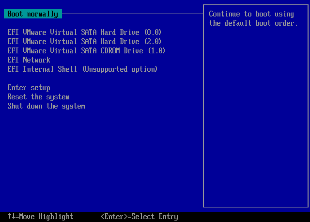
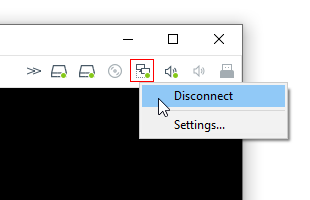
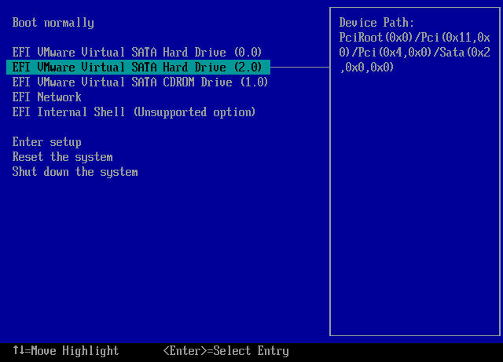
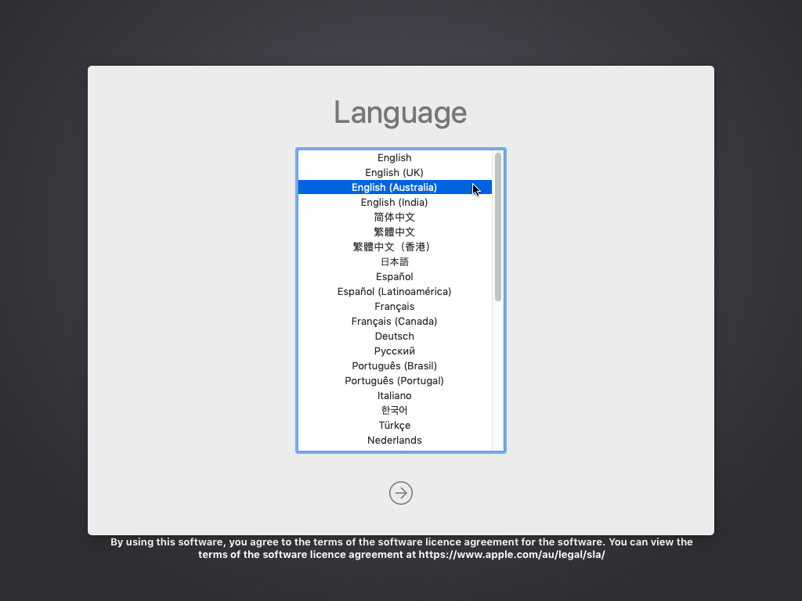
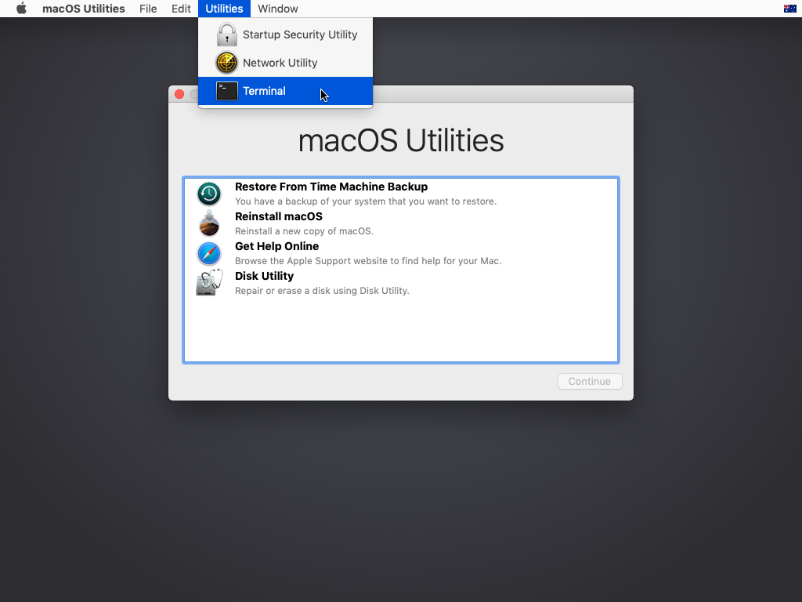
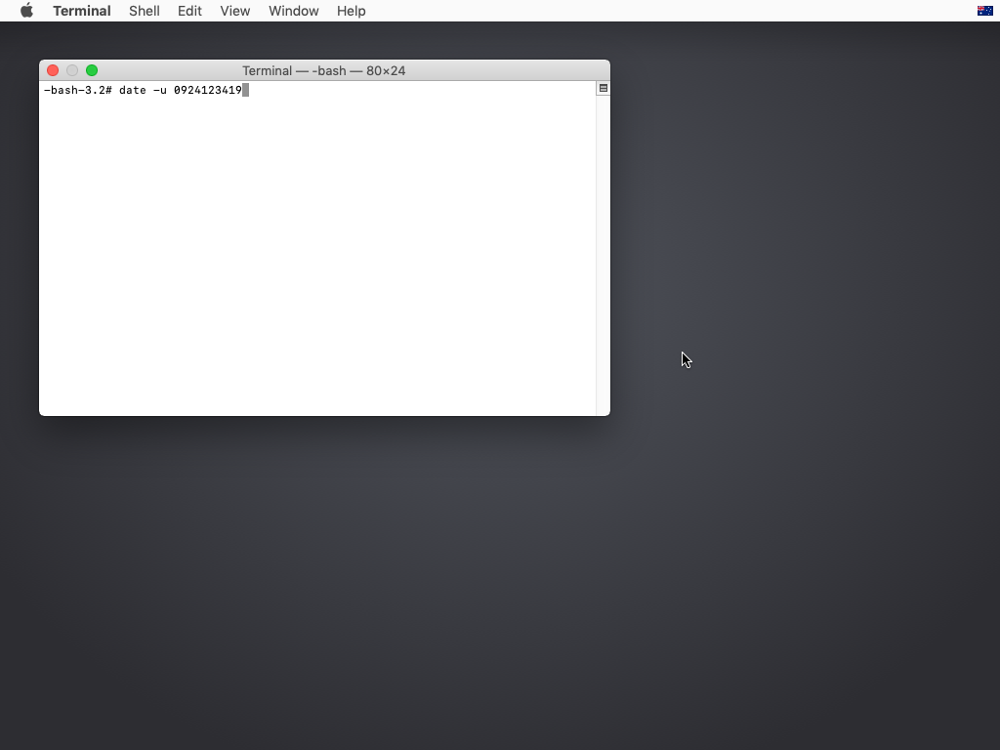
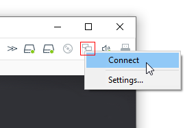

# Fixing "macOS is Damaged" error

Due to the installer certificates expiring on 25 October 2019, you will encounter this error while installing. This page is temporary and will get deleted once the 10.14.6/10.15 XNU gets released \(and I make an installer\), since those versions had their certificates renewed by Apple.

## Instructions

Select "Power on this virtual machine" and press any key to enter the BIOS.

Don't select any drives yet. In the top right hand corner of the VMware Player windows, there will be a bunch of icons. The fourth one from the left is the network adapter \(it looks like two computer linked up\). Right click it and select "Disconnect".

Select the macOS installer. It's usually "Hard Drive \(2.0\)".

Once the macOS installer boots up, select your language if it asks you.

Once macOS Utilities opens, click "Utilities" in the Finder bar and select "Terminal". Do NOT select "Reinstall macOS" just yet.

Once Terminal has opened, type `date -u 0924123419` and press enter.

It should say `Tue 24 Sep 2019 12:34:00 UTC`, which means you can close Terminal now.

Go to the next page and skip 6 steps. Start from the "opening Disk Utility" step.

Keep your network adapter disconnected during installation. Once you've reached the setup page, you can reconnect it

## A more in-depth explanation about why this error occurred

Most package files, including the macOS installer, are signed with a certificate. It's basically the developers telling the user that this package came from them and wasn't altered. 

These certficates expire after a certain time period, which need to be renewed by the original developers. In this case, the macOS installer's certificate's expiration date was 25 October 2019. Since these packages were no longer verified after that date, the installer would say that the copy of macOS is damaged or corrupted and refuse to run the installer. 

Apple has fixed this by releasing installers with reverified packages... for the latest version of Yosemite - Mojave \(10.10.5, 10.11.6, 10.12.6, 10.13.6, 10.14.6\). To get around this, we need to change the date to a date before 25 October 2019, hence the `date -u` command. We also need to disable the network adapter, so macOS can't connect to the internet and correct the time.

