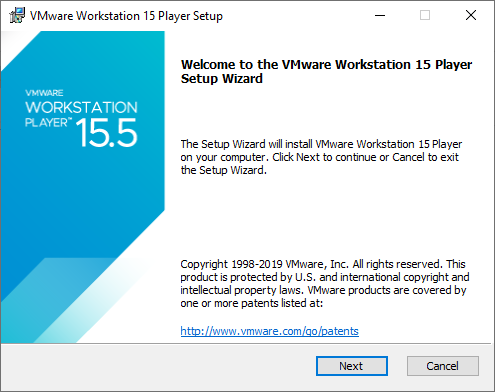
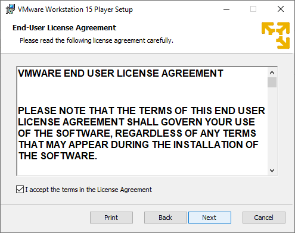
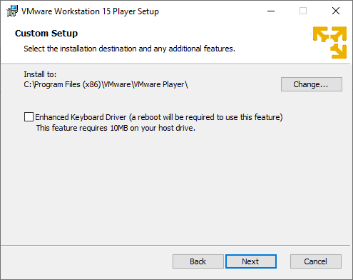
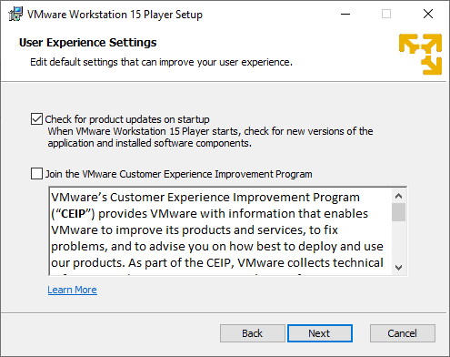
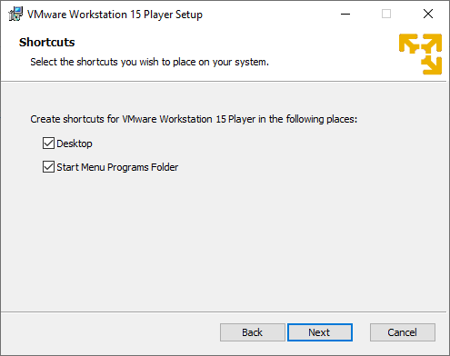
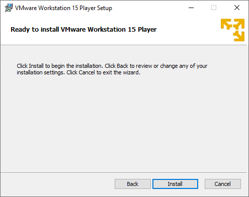
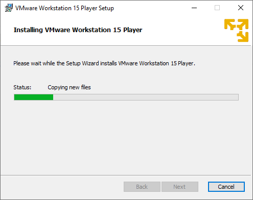
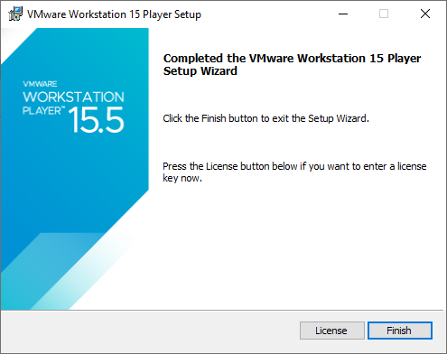

# Installing VMware Player

Since I'm not providing VMware Workstation, I'm focusing on installing VMware Player.

Click [here](https://www.vmware.com/au/products/workstation-player/workstation-player-evaluation.html) or click on "VMware Player 15" in Prerequisites to download VMware Player.

Open it up, click on "Yes" when the UAC window pops up and wait for it to get to this:

Press "Next" and agree to the terms \(or you can read it if you choose. I won't judge you\)

Press "Next" and "Next" again. If you want to install the Enhanced Keyboard Driver, you can but it's not required for this.

Press "Next". I recommend that you keep "Check for product updates on startup" ticked, since it will alert you if there's a new version of VMware available. Keep in mind that everytime you update VMware, you'll need to reinstall VMware Unlocker. I'm going to untick "Join the VMware Customer Experience Improvement Program" but you can enable if you'd like to.

Press "Next". I like to keep these options ticked but you can untick them if you want to.

Press "Next" and "Install". Sit back and let VMware Player install. This will take a few minutes.

Press "Finish" and VMware Player has been installed!

