# Installing VMware Tools

Now, time to install VMware Tools to get all of the drivers on the virtual machine.

Select "Player" in the top left -&gt; "Manage" -&gt; "Install VMware Tools".

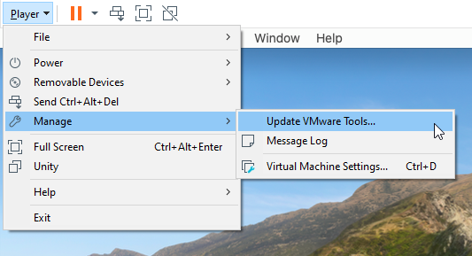

The VMware Tools ISO will mount to the virtual machine. Run "Install VMware Tools".

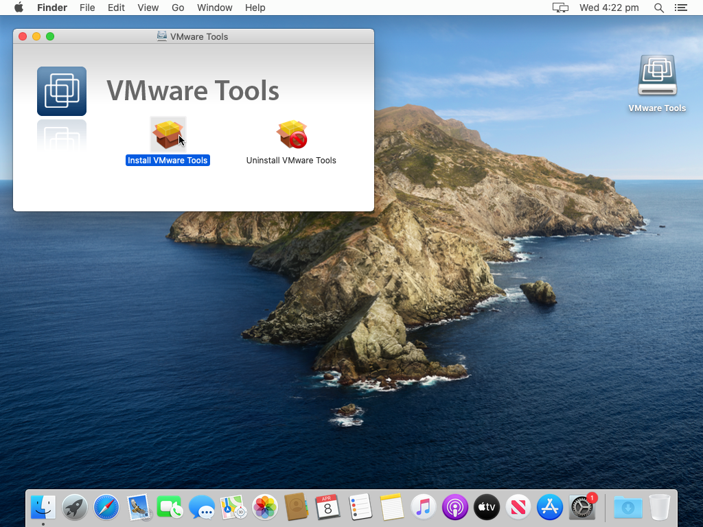

Select "Continue".

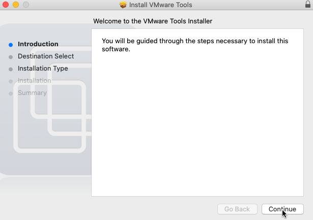

Select "Install".

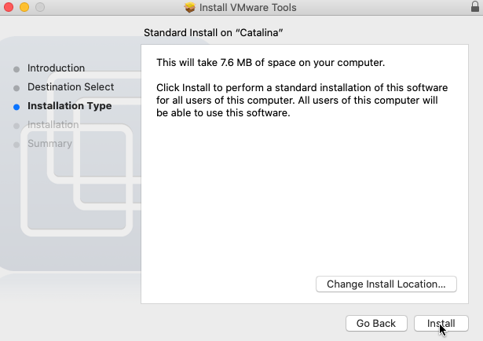

Then, "Continue Installation".

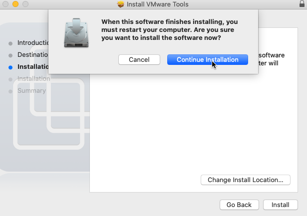

Enter your password and press "Install Software".

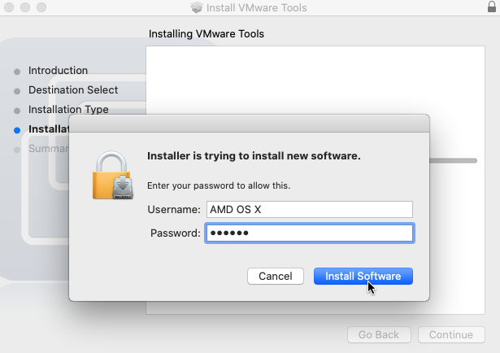

This error may come up. If it does, click "Open Security Preferences".

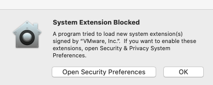

Click the lock in the bottom-left corner.

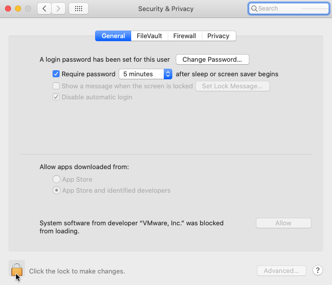

Enter your password and press "Unlock"

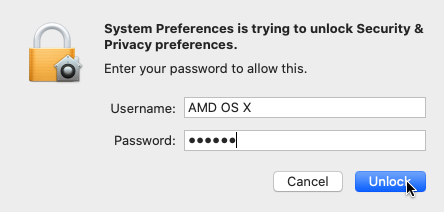

Press "Allow" on "System software from developer 'VMware, Inc.' was blocked from loading".

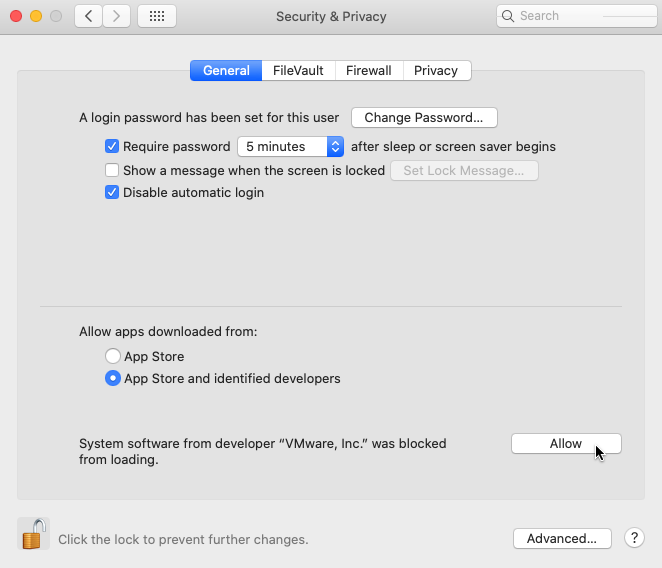

VMware Tools should be done by now. Select "Restart" and let your machine reboot by itself.

Congratulations, you've just made a macOS VM. See, it wasn't so bad after all. You may have noticed that your keyboard and mouse isn't working. Don't worry, it fixes itself after about 2 minutes of leaving the machine idle. This issue happens on bootup and there is currently no fix for this. Do not ask when it will be fixed, the page will get updated when there is a fix and I will post about it on the AMD OS X discord.

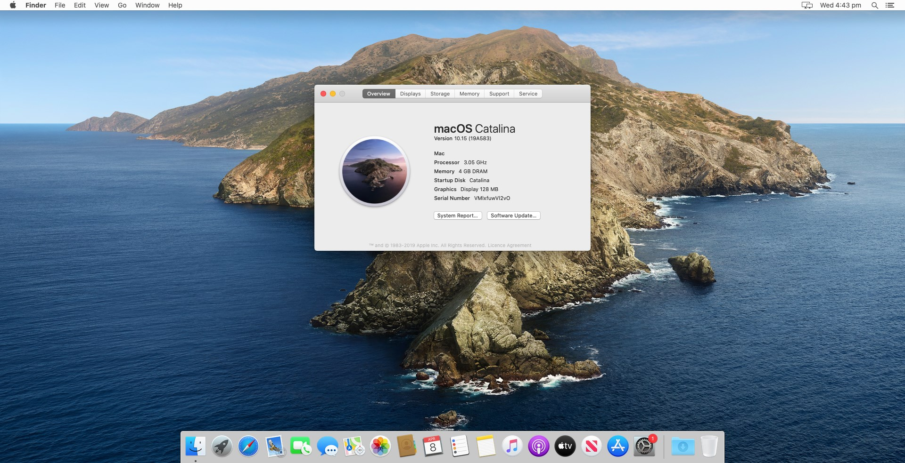

