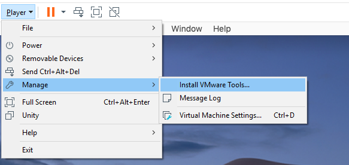
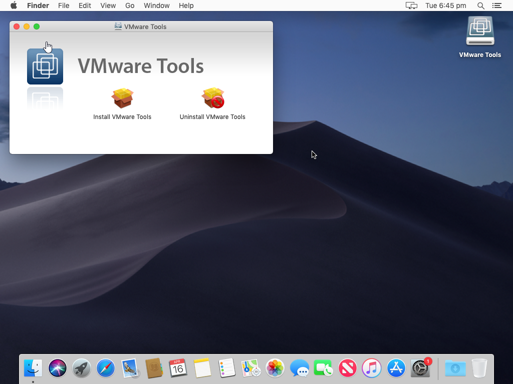
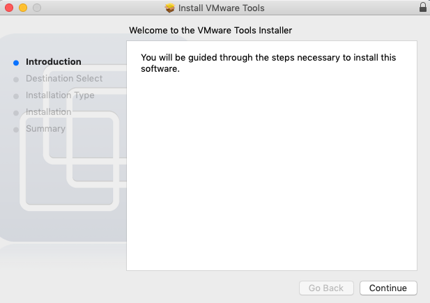
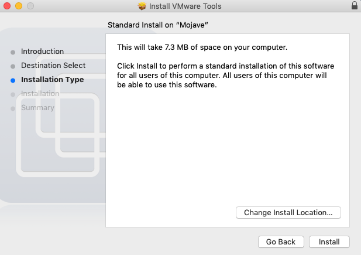
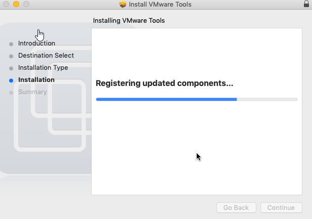
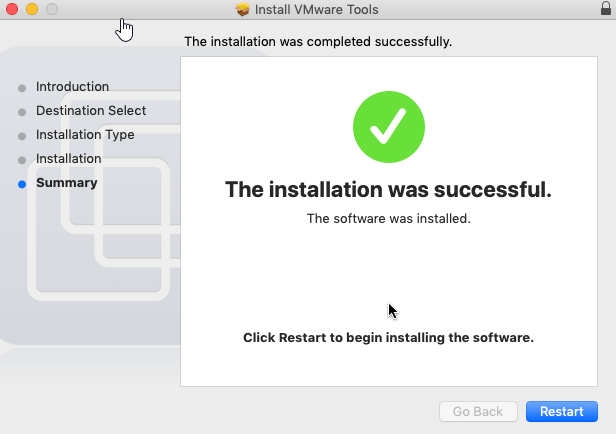
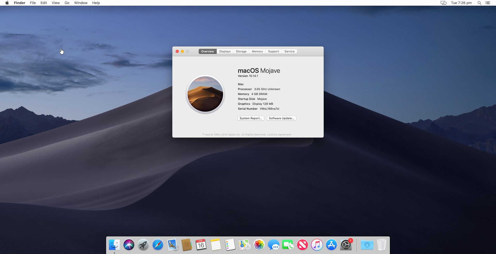

# Installing VMware Tools

Now, time to install VMware Tools to get all of the drivers on the virtual machine.

Select "Player" in the top left -&gt; "Manage" -&gt; "Install VMware Tools".

The VMware Tools ISO will mount to the virtual machine. Run "Install VMware Tools".

Select "Continue".

Select "Install".

Then, "Continue Installation".

Enter your password and press "Install Software".

Now, wait for it to install.

Select "Restart" and let your machine reboot by itself.

Congratulations, you've just made a macOS VM. See, it wasn't so bad after all. 

