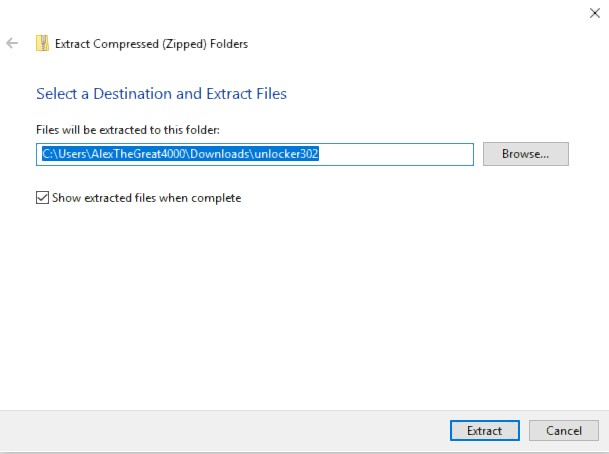
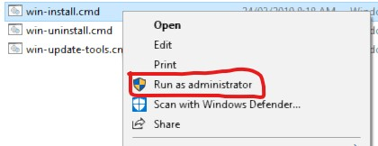
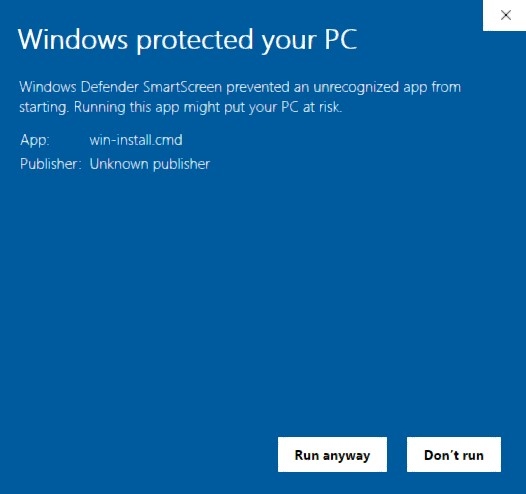
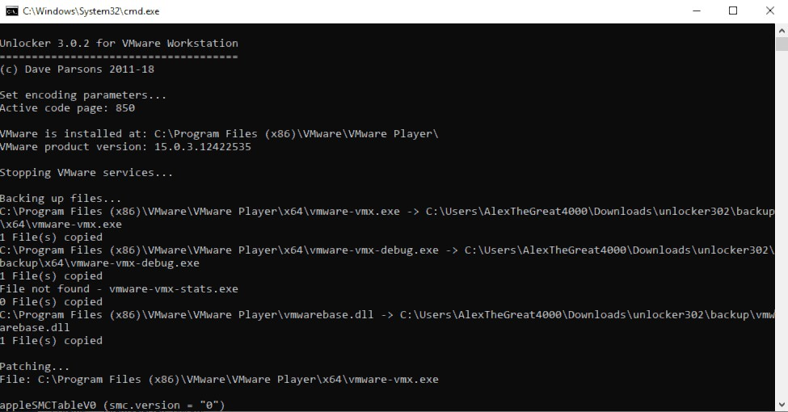
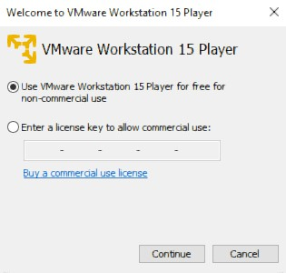
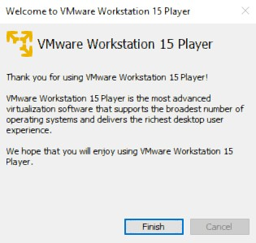

# Installing VMware Unlocker

Click [here](https://github.com/DrDonk/unlocker/archive/master.zip) or click on "VMware Unlocker" in Prerequisites to download VMware Unlocker.

Once you've downloaded it, unzip to a folder with all of the contents inside of it. 

Open that extracted folder and find "win-install.cmd". Right click that file, select "Run as administrator".

If you get the "Windows protected your PC" pop up, click "More Info" and press "Run anyway". Don't worry, it's nothing malicious.

Accept the UAC prompt and a Command Prompt window will open. Sit back and let VMware Unlocker install. This shouldn't take too long.

Once that window has closed, VMware Unlocker has installed successfully. You'll notice that VMware Player will show a welcome window. Select "Use VMware Workstation 15 Player for free for non-commercial use" and press "Continue". Then press "Finish".

