# Making the virtual machine

Now that you've installed VMware Unlocker, open up VMware. 

Select "Create a New Virtual Machine".

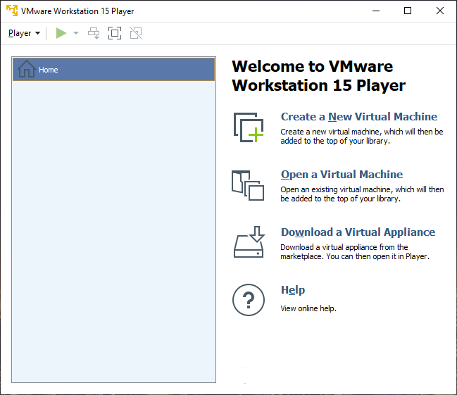

#### This step is for VMware Workstation people only. VMware Player people can skip to the next step

Choose "Typical \(recommended\)"  and press "Next".

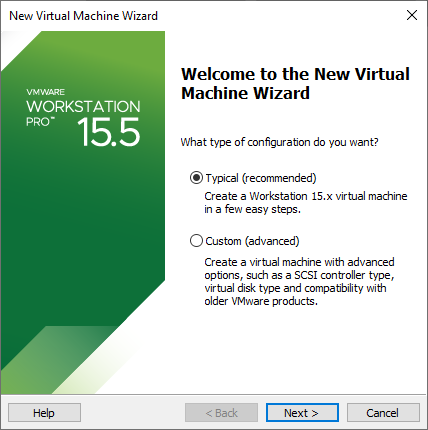

Select "I will install the operating system later".

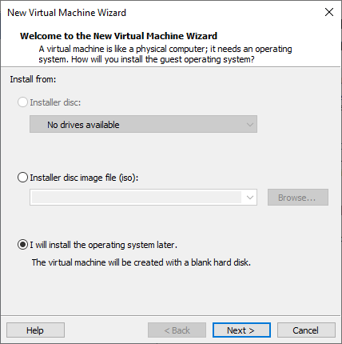

Select "Apple Mac OS X" under `Guest operating system` and choose "macOS 10.15" under `Version`.

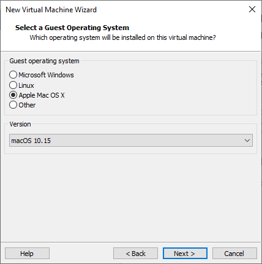

Under `Virtual machine name:` "macOS 10.15" will automatically be typed in. You can change this if you want but I'll keep it at the default. Don't worry about `Location:` unless you know what you're doing.

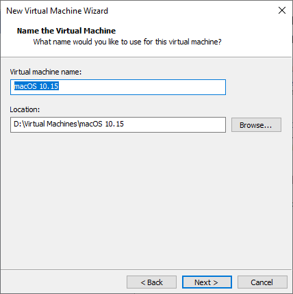

Under `Maximun disk size (GB):` the default is "40.0". You can change this size if you wish but I'll keep it at the default size. Keep in mind that the OS will be about 15GB, but macOS requires about 25GB of space to install, so don't go lower than that. Don't go crazy with the virtual hard drive size as this file will be stored on our actual hard drive, so make it a reasonable size. Choose `Store virtual disk as a single file` and press "Next".

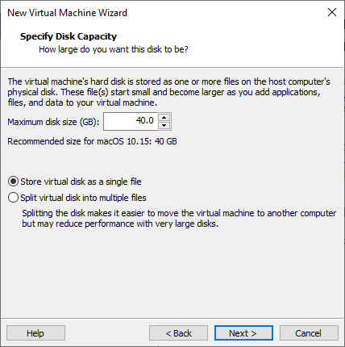

Press "Finish" and your VM should pop up in VMware.

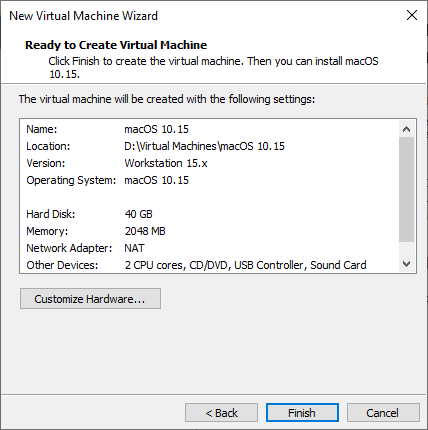

Select "Edit virtual machine settings".

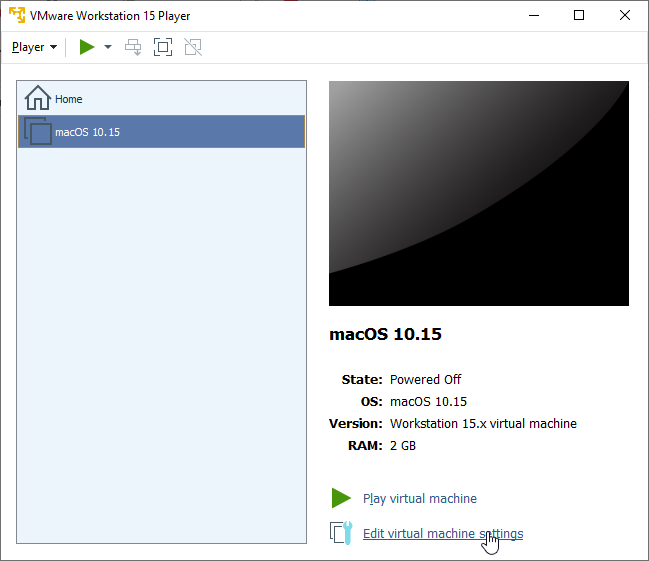

The `Memory` section should be selected by default and should have 2 GB of RAM entered by default. This is a very low amount of RAM for macOS and will make macOS run very slow. If you have 8 GB of RAM in your PC or more, it is recommended to increase the VM's memory to at least 4 GB \(4096 MB\) which is what I'll be doing.

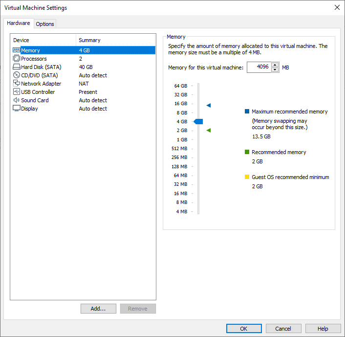

Select `Processors` and select `Number of processors:` to "1". Under `Number of cores per processor:` select the amount of cores that you want to allocate to your VM. You want to have minimum 2 cores allocated and maximum however many cores your CPU has. With virtual machines, you need to allocate some resources like RAM and CPU cores to your virtual machine while still keeping enough for your host operating system. 

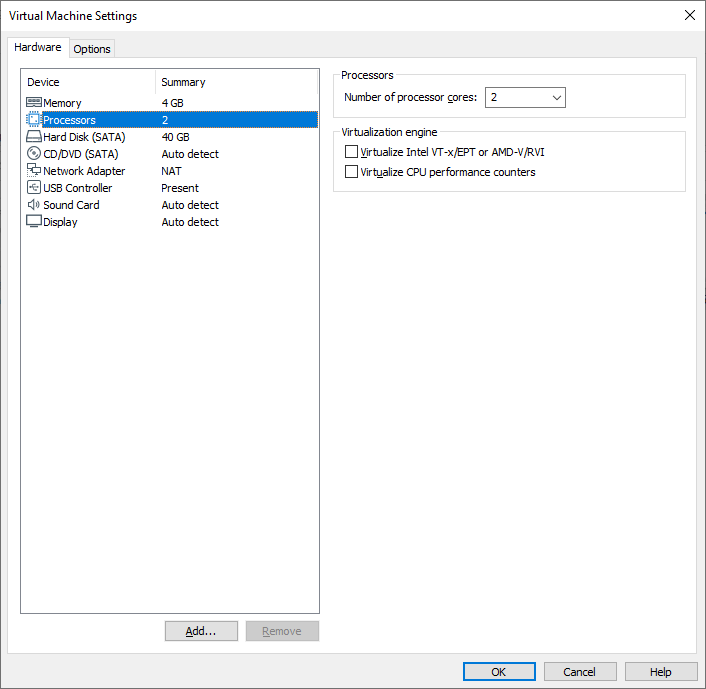

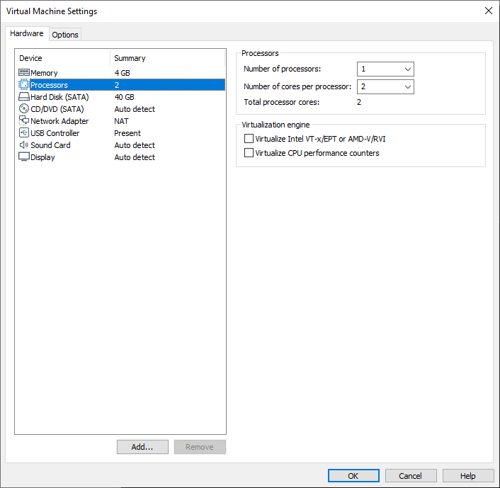

Press "Add...". Select `Hard Disk` and press "Next". 

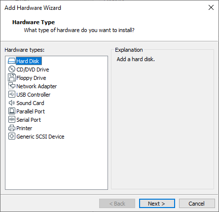

Select `SATA` and press "Next".

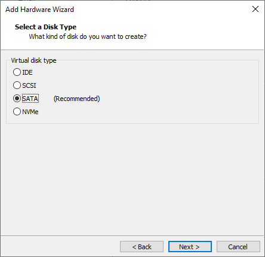

Select `Use an existing virtual disk` and press "Next". 

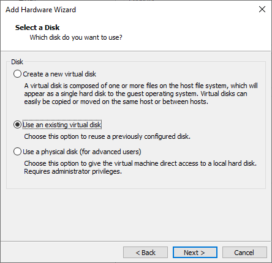

Press "Browse..." and select "CatalinaAMD.vmdk" from wherever you downloaded it. Press "Finish" and press "OK".

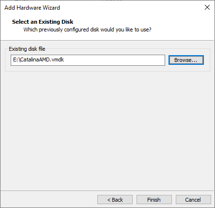

Press "OK" and minimize VMware for the moment.

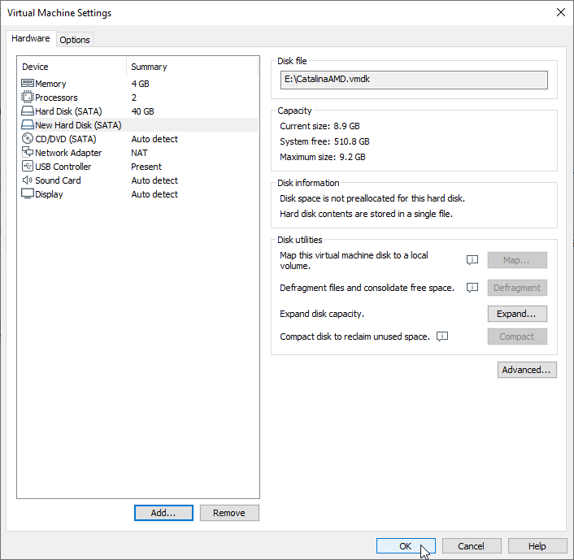

Navigate to `your Documents folder/Virtual Machines/macOS 10.15 (or whatever you named your VM to)` and open `macOS 10.15 (or whatever you named your VM to).vmx` in a text editor. 

Make a new line and add this: `bios.bootDelay = "2000"` \(measured in milliseconds\). This will delay the BIOS boot up time by 2 seconds giving you a chance to get into the UEFI BIOS if you need to \(which we will need to in a minute\).

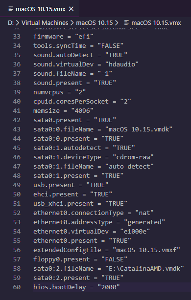

Save the changes. You've now successfully made your virtual machine. Now time to install macOS on it.

